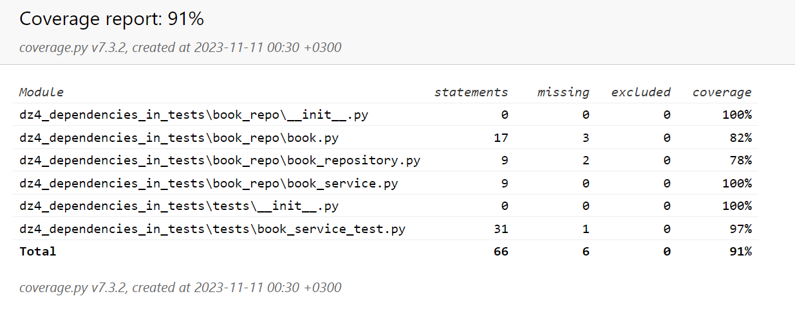
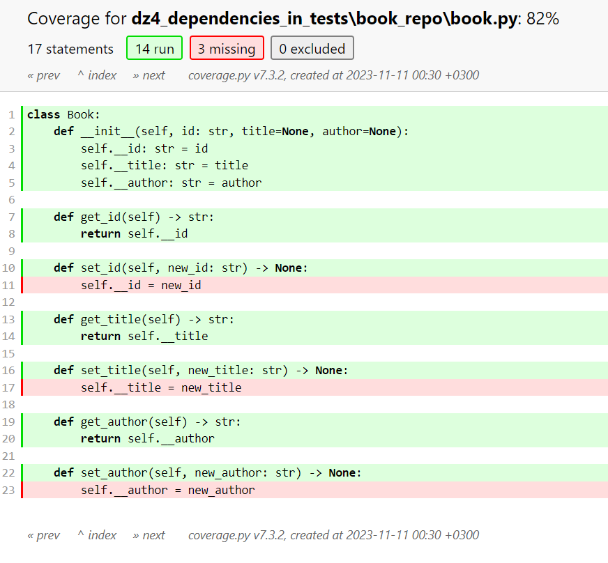
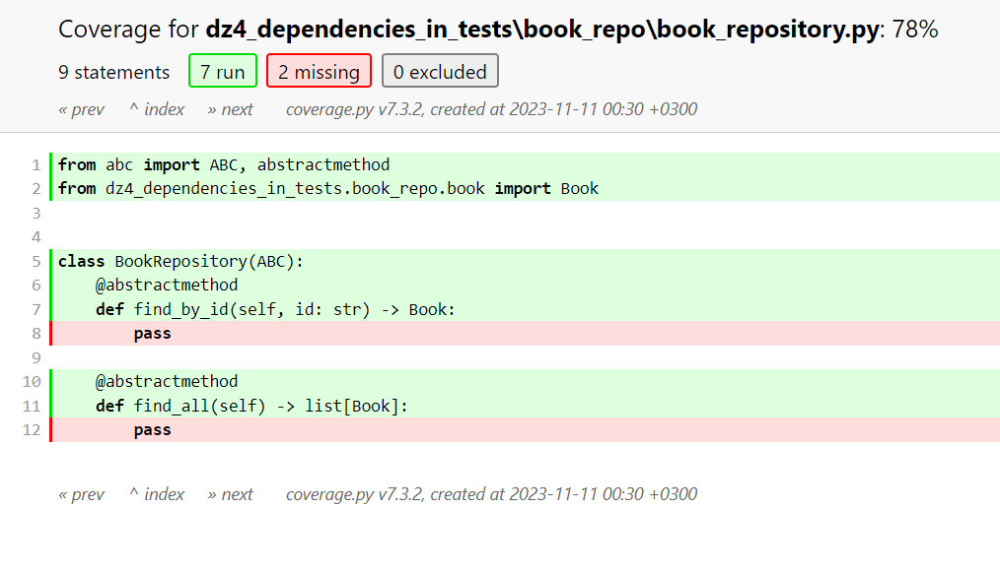
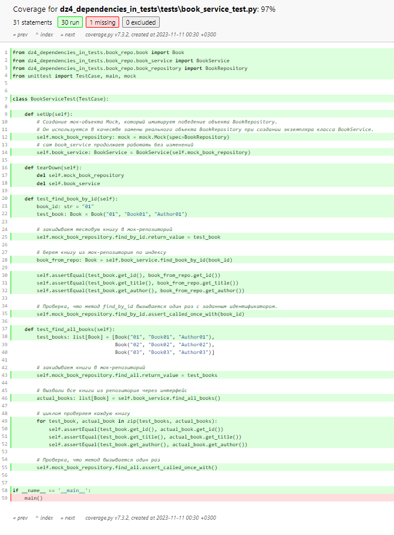

Ответы на вопросы

1) Почему использование тестовых заглушек может быть полезным при написании модульных тестов?

Использование тестовых заглушек может быть полезным при написании модульных тестов,
поскольку они позволяют изолировать тестируемый модуль от зависимых или сложных компонентов.
Заглушки могут заменять реальные объекты или методы,
чтобы упростить и ускорить тестирование,
а также создать предсказуемые и контролируемые условия для проверки определенного поведения.

2) Какой тип тестовой заглушки следует использовать, если вам нужно проверить, что метод был вызван с определенными аргументами?

Spy - шпион.
Этот тип заглушки позволяет записывать информацию о вызовах метода,
включая переданные аргументы, и потом можно проверить эту информацию в тесте.

3) Какой тип тестовой заглушки следует использовать, если вам просто нужно вернуть определенное значение или исключение в ответ на вызов метода?

Mock - мок.
Этот тип заглушки позволяет программно задать ожидаемый результат или исключение,
которые должны быть возвращены при вызове метода.

4) Какой тип тестовой заглушки вы бы использовали для имитации взаимодействия с внешним API или базой данных?

Stub - ложная.
Эти заглушки обычно предоставляют простую реализацию,
которая возвращает предопределенные данные или имитирует определенные события,
без реального взаимодействия с внешними системами.

___

Coverage

